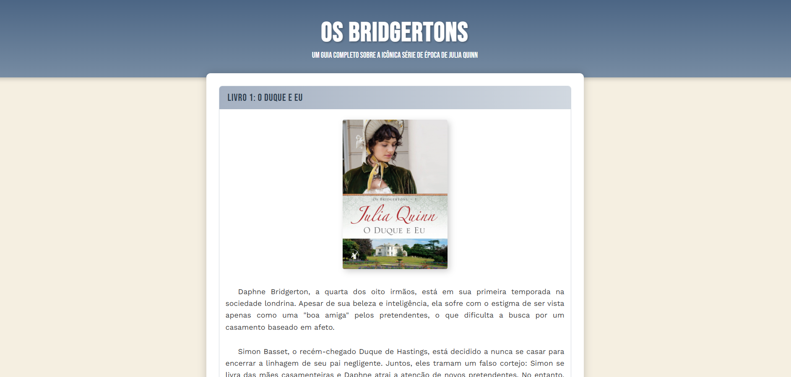
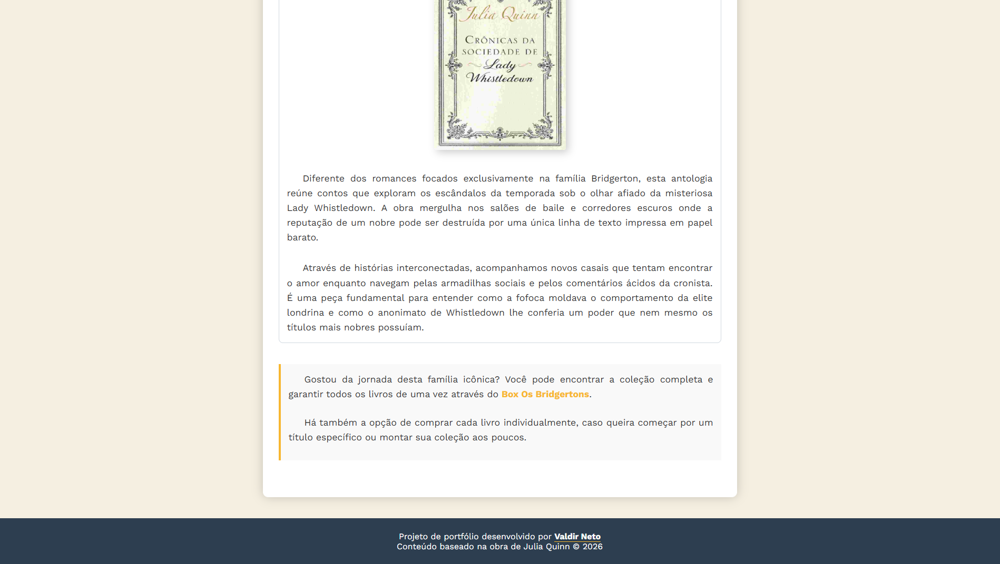

# 📚 Guia de Leitura: Os Bridgertons

Este projeto é um guia interativo e visual sobre a aclamada série de livros "Os Bridgertons", de Julia Quinn. O objetivo é fornecer resumos detalhados de cada obra, orientações de compra e sugestões de ordem de leitura para novos fãs da saga.

---

## 🚀 Tecnologias Utilizadas

Para o desenvolvimento deste projeto, foquei em práticas modernas de desenvolvimento web front-end:

* **HTML5:** Estruturação semântica de conteúdo.
* **CSS3:** Estilização avançada utilizando Variáveis CSS (Custom Properties) para manter a consistência visual.
* **Design Responsivo:** Adaptabilidade para diferentes tamanhos de tela (Desktop e Mobile).
* **Google Fonts:** Implementação de tipografia específica para remeter à estética da Regência Britânica.

---

## 🎨 Diferenciais do Projeto

* **Estética Temática:** Paleta de cores inspirada no Azul Wedgwood e tons de pergaminho.
* **Organização por Componentes:** Cada livro é uma classe `.livro` independente.
* **Interatividade:** Efeitos de flutuação (*hover*) e transições suaves.

---

## 📖 Como visualizar o projeto?

O site está hospedado via **GitHub Pages** e pode ser acessado através do link abaixo:

[👉 Clique aqui para acessar o Guia de Leitura](https://valdirneto34.github.io/Projeto-Bridgerton/)

---

## 🛠️ Como rodar localmente?

1. Clone este repositório:
   ```bash
   git clone [https://github.com/valdirneto34/Projeto-Bridgerton.git](https://github.com/valdirneto34/Projeto-Bridgerton.git)

---

## 📖 Screenshots do Projeto
   <p align="center">
        
    </p>
   <p align="center">
        
    </p>